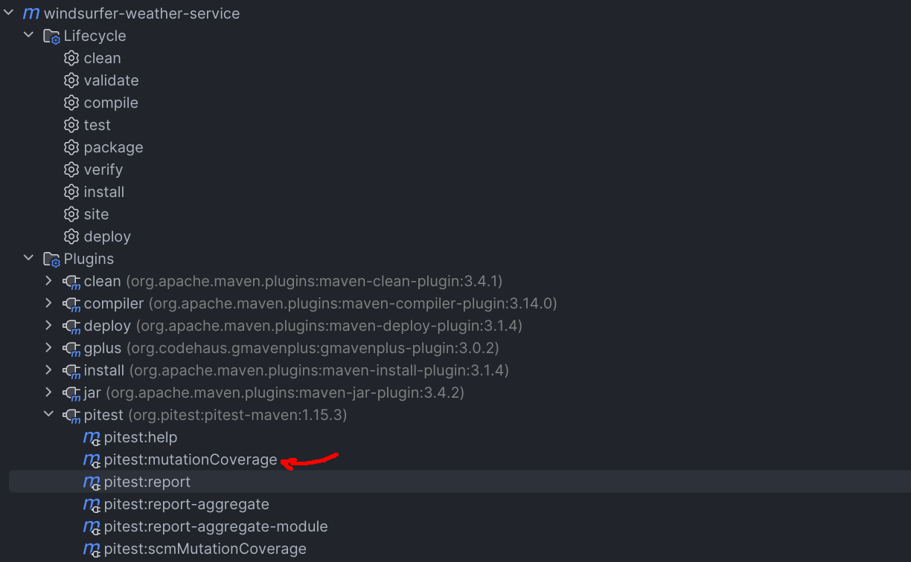
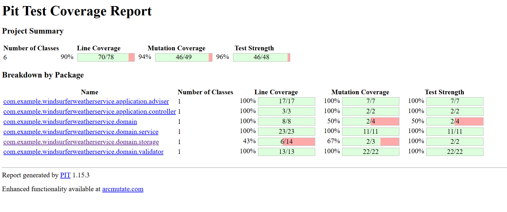

# 🌊 Windsurfer Weather Service

REST API service that helps windsurfers find the best location for their sport based on real-time weather conditions. The service analyzes wind speed and temperature data from multiple locations and recommends the optimal spot for windsurfing.

## ✨ Features

- **Smart Location Recommendation**: Analyzes weather conditions across multiple locations
- **Weather Data Integration**: Fetches real-time forecasts from WeatherBit API
- **Scoring Algorithm**: Calculates optimal conditions based on wind speed (5–18 m/s) and temperature (5–35°C)
- **Flexible Configuration**: Easy location management via JSON/YAML configuration
- **Comprehensive Validation**: Input validation with detailed error responses

## 🛠 Technologies

- **Java 21**
- **Groovy 4**
- **Spring Boot 3.5.6**
    - Spring Web
    - Spring WebClient
    - Spring Validation
- **Lombok** – Reduce boilerplate code
- **Jackson** – JSON processing
- **WeatherBit API** – Weather data provider
- **Spock Framework** – Testing (Groovy-based)
- **Pitest** – Mutation testing
- **Swagger/OpenAPI** – API documentation

## 🏗 Architecture

The project follows a **layered architecture** with clear separation of concerns:

Controller → Facade → Service → WeatherBitClient
↓
Validator

markdown
Copy code

- **Controller Layer**: HTTP request handling and validation
- **Facade Layer**: Orchestrates business logic flow
- **Service Layer**: Core business logic (independent methods)
- **Validator Layer**: Weather condition validation
- **Client Layer**: External API communication

## 🚀 Getting Started

### Prerequisites

- Java 21 or higher
- Groovy 4 or higher
- Maven 3.8+
- WeatherBit API key (https://www.weatherbit.io/api)

### Installation

Clone the repository:

Configure your API key in application.yml:

```yaml
weatherbit:
  api:
    url: https://api.weatherbit.io/v2.0
    key: YOUR_API_KEY_HERE
```
Build the project:
mvn clean install

Run the application:
mvn spring-boot:run

📡 API Documentation
Get Best Windsurfing Location
Endpoint: GET /api/windsurfing/best-location

Parameters:
date (required): Date in format yyyy-MM-dd (today or future)

Example Request(Postman):
GET "http://localhost:8080/api/windsurfing/best-location?date=2025-10-10"

🧪 Testing
Run Unit Tests(Spock): *Spec.groovy – Test individual components in isolation

Test Coverage Report
Run Mutation Tests (PIT)

- mvn clean
- mvn install
- mvn org.pitest:pitest-maven:mutationCoverage



### View coverage report at: target/pit-reports/index.html




## 🏗 Architecture

The project follows **Hexagonal Architecture

📁 Project Structure
```plaintext
src/
├── main/
│   ├── java/com/example/windsurferweatherservice/
│   │   ├── application/              # Application layer
│   │   │   ├── adviser/              # Exception handlers
│   │   │   └── controller/           # REST controllers
│   │   ├── domain/                   # Core domain logic
│   │   │   ├── model/                # Domain entities
│   │   │   ├── service/              # Business logic
│   │   │   ├── storage/              # Storage port
│   │   │   ├── validator/            # Domain validation
│   │   │   └── WindsurfingFacade.java
│   │   ├── infra/                    # Outbound adapters
│   │   │   └── WeatherBitClient.java
│   │   ├── shared/config/            # Shared configuration
│   │   │   ├── JacksonConfig.java
│   │   │   ├── WebClientConfig.java
│   │   │   └── WindsurfingLocationsConfig.java
│   │   └── Application.java
│   └── resources/
│       ├── application.yml
│       └── data/
│           └── locations.json
└── test/
    └── groovy/                       # Spock tests
        ├── application/              # Application layer tests (facade, controllers)
        └── domain/                   # Domain logic tests
```

## Author
> **Diana Timurkyzy**


